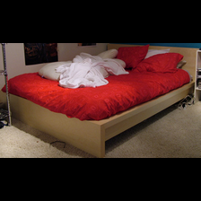
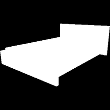
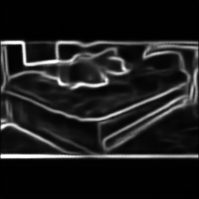
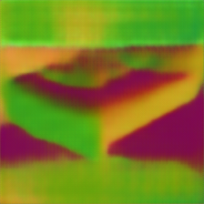
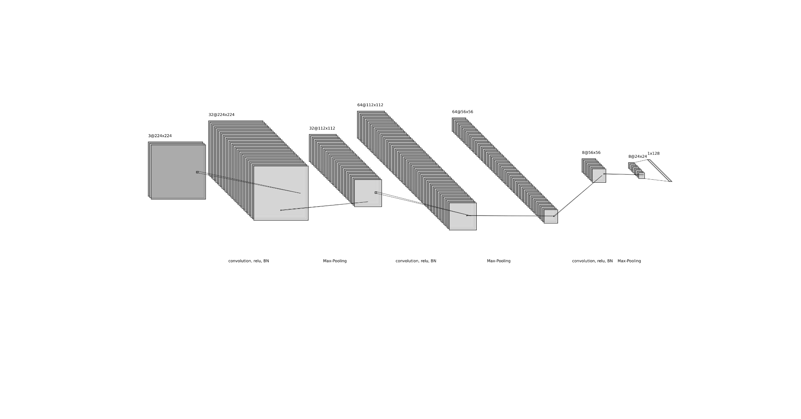

# Pose-Estimation-on-Pix3D-Dataset
The goal is to train end-to-end models for pose estimation on the Pix3D dataset. The pose estimation task is defined as a classification task. The model should classify the pose into eight bins.
***Pose Estimation on Pix3D Dataset***

**Goal**:

The goal is to train end-to-end models for pose estimation on the Pix3D dataset.

The pose estimation task is defined as a classification task. The model should classify the pose into eight bins.

**Dataset:**

The model is trained on the Pix3D dataset. The input images are resized to 224\*224.

The model inputs are **RGB image, Mask, Boundaries, and Normals**. 

The Mask is a ground truth mask.

The normal and boundaries are generated using mead level representation paper.

The sample set of inputs are shown in the following.

**Models:**

In general, we have made two models, combined\_net and seperate\_net.

- Combined\_net, In this model, a single convolution network consumes all the set of inputs (RGB, mask, boundaries, and normal) with eight channels. 

**Combined\_net**

|Layers|Input channel, Output channel, kernel size (if CNN)|
| :- | :-: |
|
conv2D

BatchNorm2d

Relu

MaxPooling (2\*2)
|
8, 64 , (7\*7)

|
|
conv2D

BatchNorm2d

Relu

MaxPooling (2\*2)
|64, 256 , (7\*7)|
|
conv2D

BatchNorm2d

Relu

MaxPooling (2\*2)
|256, 256 , (3\*3)|
|
conv2D

BatchNorm2d

Relu

MaxPooling (2\*2)
|256, 8 , (3\*3)|
|Fully connected |8\* 11\* 11 , 128|
|Fully connected / azimuth|128, 8|
|Fully connected / elevation|128, 8|
|Fully connected / inplane\_rotation|128, 8|

- Separate\_net, In this model, each RGB, mask, boundaries, and normal feed separate convolution layers, and after some layers, The feature maps are concatenated together.

**Separate\_net**

For each input (RGB, normal, mask, depth) we have the following network and at the end all feature layers are combined together to estimate the bin of the pose.

**Training:**

The train and test split is randomly using the torch.split module. The ratio of train to test is 1/10.

The learning rate for Combined\_net is 0.00001 and divided by 10 every 3 epochs.

The learning rate for Separate\_net is 0.001 and divided by 10 every 3 epochs.

Both models trained end to end using **cross entropy loss function**. You can see the loss function in the following:

*train\_loss = cross\_entropy(azimuth, azimuth\_labels\_bin)+ cross\_entropy(elevation, elevation\_labels\_bin)+ cross\_entropy(in\_rotation, in\_rotation\_labels\_bin)*

Models are trained for 25 epochs.

**Results**: 

The models were evaluated in separate phases. 

1. In terms of inputs, 4 different models were trained. 
   1. Only RGB input
   1. RGB and mask
   1. RGB, mask, and boundaries
   1. RGB, mask, boundaries, and normals

1. In terms of models
   1. Combined net
   1. Separated net

The numerical results are shown in the following table. The results are for azimuth.

|
Models , 

|RGB|RGB+Mask|RGB+ Mask+ Boundaries|RGB + Mask + Boundaries + Normals|
| :- | :- | :- | :- | :- |
|Combined\_net |56.8862|72.0559|64.3713|65.5329|
|Seperated\_net |50.7984|36.9261|38.1238|41.1178|

**Conclusion**:

The results show that the Mask helps a lot, since it's a ground truth mask. 

For the separate model, the results are not good enough.

